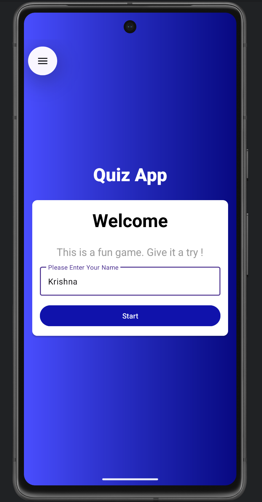
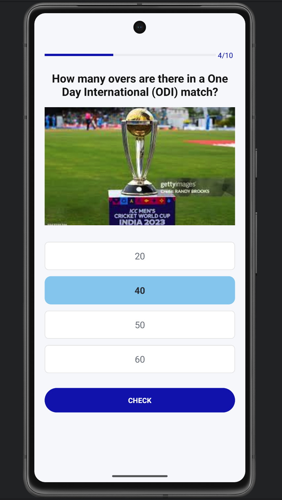
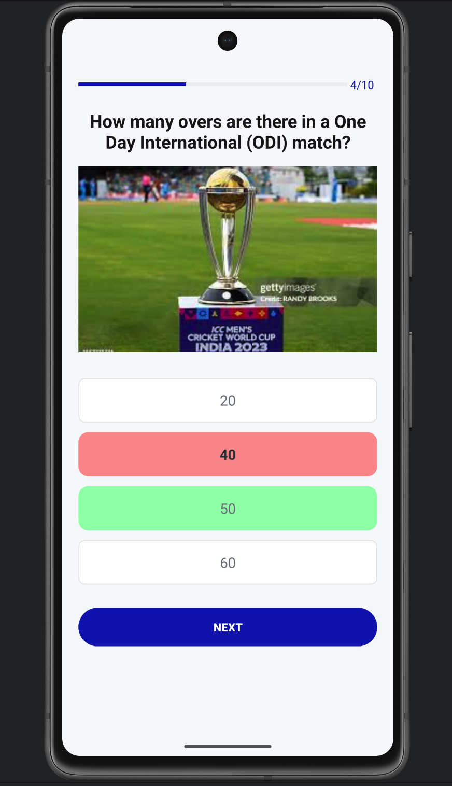

# 🏏 Cricket Quiz App

A fun and interactive **Cricket Quiz App** built using **Kotlin**, **XML**, and **Gradle** in **Android Studio**.  
This app tests your cricket knowledge with 10 multiple-choice questions and displays your final score at the end!

---

## 🚀 Features

- 📱 **Simple & Interactive UI** — built using XML layouts  
- 🧠 **10 Cricket Questions** — covering rules, players, and records  
- ✅ **Instant Feedback** — shows the correct answer after clicking **Check**  
- 🔁 **Next Question Navigation** — move to the next question easily  
- 🏁 **Final Score Display** — shows your total score after all questions  
- 💾 Built using **Kotlin**, **Gradle**, and **Android SDK**

---

## 🧩 Tech Stack

| Component | Technology |
|------------|-------------|
| Language | **Kotlin** |
| UI Design | **XML Layouts** |
| Build System | **Gradle** |
| IDE | **Android Studio** |
| SDK | **Android SDK** |

---

## 📸 App Flow & Screenshots

| Home Screen | Question Screen |
|--------------|----------------|
|  |  |

| Answer Checked | Result Screen |
|----------------|----------------|
|  |  |

